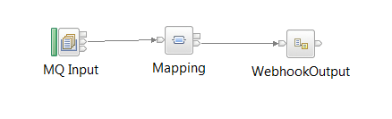

# How to modify the Warehouse sample to perform your own integration
Steps to take to modify the Warehouse sample to create your own integration from IIB To App Connect using a real back end system within your company.

## Introduction
It is very easy to construct your own flow that follows the same lines as the [Warehouse sample](./whatwarehouse.md). It is worth taking a quick look at how that sample works before creating your own integrations.

## Creating a new IIB integration to send events to App Connect
Take a look at the Warehouse sample message flow that maps from a Warehouse event to App Connect:

The important part of this flow for sending events to App Connect are the mapping node and the webhook subflow that follows it. The mapping node converts from the complex incoming data structure to a simple JSON doc App Connect can understand and the subflow then does all the function required to implement a webhook pattern App Connect can interact with.
To create a new message flow that receives your own events and sends them to App Connect you first need to construct the first part of the flow that using nodes in IIB like MQ, SAP, File and so to receive events. Then add in a mapping node that maps to simple JSON structure followed by a webhook subflow to set up the webhook point.
For example, if I wanted to take an event from MQ and send it to App Connect then I would construct a flow like the following:

I would need to map the structure coming from MQ to a simple JSON structure. The structure coming from MQ could be anything from a simple XML document to a complex EDIFact message. The JSON structure in the map that it is mapped to must have a root element called `JSON` followed by a child element called `Data` that has a child called `eventData`. There needs to be one element beneath the eventData element for each field to send to App Connect. For the warehouse sample there were five fields: id, name, description, size and color. The map for this looks like:

The left half of the map is from the incoming data from MQ and the right is the JSON doc to send to App Connect. Your map will contain whatever data you want on the left and right as long as the JSON doc on the right conforms to the basic structure mentioned above.

The webhook subflow needs to directly follow the mapping node and contain three properties you must set:

* EventType - the name of the event that will be sent to App Connect. Use a name that is meaningful for your event like `newCustomer` or `changeAddress`. it will appear as the Trigger name in App Connect.
* WebhookBaseUrl - the URL that is used to register for events from this webhook. It is NOT the url that is actually called to send the event but instead the URL to POST the callback URL to. The path can be anything you like but ideally would reflect the source of events with /hook added to the end but it is up to you what the exact path is. It does not have to end in /hook. Some examples: /warehouse/stock/hook, /customer/address/hook, /customer or /AB/F5.
* WebhookStarUrl - must be identical to WebhookBaseUrl except suffixed by `/*`. This is only required due to a limitation in how properties are promoted from a sub flow.

 Now the flow is constructed, it can be deployed to IIB ready to be used by App Connect. It does not at this point need to know any App Connect details.

## Creating a new Application Definition file for the IIB integration
To configure App Connect to use the IIB flow, a new Application Definition file needs to be created to define the new webhook contained in the messageflow that has been deployed to IIB.

Copy the Warehouse sample [Warehouse Webhook definition file](./warehousedefinition.yaml) and give it a name suitable for your new end system.

Open the file.

* Replace all instances of the path /warehouse/stock/hook with the path you used on the webhook subflow  WebhookBaseUrl (for example: /customer/address/hook).

* Replace all instances of `warehouse` with your new name (avoiding spaces).

* Find the newStock event and change it's details to reflect the new event you are generating. This will involve changing all instances of newStock to the new name and changing the JSON schema used to have the correct fields.

* Find the host entry and replace it with the hostname:port for IIB. The port is not the IIB admin port (normally 4414) but is instead the port used by the message flow (normally 7800). If you want to use unsecured HTTP then change https in schemas to http.

Go through the description in the rest of the file and change them to more meaningful values for you particular system.

The file is now ready to be used by App Connect to create a new App.

## Create new App in App Connect
Take the modified Webhook definition file and use it in App Connect to make a new App. You can call the App whatever you like (for example: Warehouse, CustomerAddress or MyCRMSystem).

## Using the new App in App Connect flows
Now everything is ready in App Connect to create a flow to receive the event from IIB and map it to another App. Create a flow in the App Connect UI selecting the new App as the trigger and any other App as the action to be done. Google sheets is the most straight forward if you do not have any real system to send the data to at this moment.

Once created, turn the flow on.

App Connect should now subscribe with IIB for any available events from your new integration. Drive your IIB messageflow to test it now works end-to-end.
