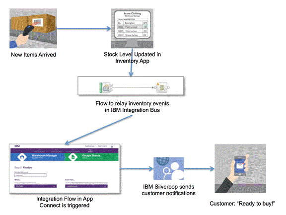
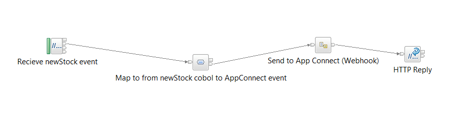
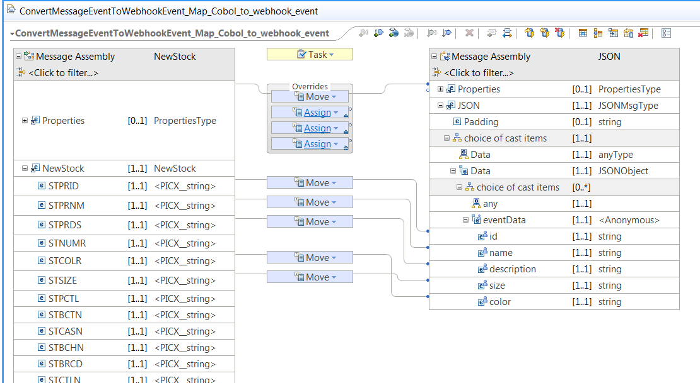

# Explanation of Warehouse sample
A detailed explanation of what the Warehouse sample is showing and how it was constructed.

## Introduction
The Warehouse sample show how the integration between a backend on-premises system and another system can be done using App Connect with the help of IIB.

Lets first take a look at the use case before diving into the detail.

## Setting the scene

There is a retail company that has an online store. The inventory for the componay is managed by commercial software to keep track of stock levels of each item that is sold through the online storefront. The IT department uses IBM Integration Bus to keep the inventory system in sync with other systems such as procurement, order fulfillment and shipping.

Now the marketing department wants to organize some campaigns around a few popular items. Because the items are in short supply, inventory has been consistently low. The department wants to engage their customers who have visited the store and searched for these items, but found that they were out of stock.

So the idea is to send instant notifications to these customers as soon as the inventory application has updated the stock for the items. Because App Connect at the moment only supports a limited number of applications, the Warehouse sample will use Google Sheets as the target action in the place of IBM Silverpop. The goal is to get the newly stocked items to show up in a Google Spreadsheet as a new row. This simulates the API call to IBM Silverpop to notify customers of the stock level update. The flow of data through the system when a new stock item event occurs will be as follows:

1.	Inventory management application fires the stock increase event
2.	An integration flow in IBM Integration Bus (IIB) picks up this event and passes it along to IBM App Connect
	*	For this to happen, you must first use IBM App Connect to subscribe to this event with IIB
3.	An integration flow in IBM App Connect picks up the event and passes it along to the digital campaign application for customer engagement, such as Marketo or IBM Silverpop
4.	Customers get personalized notifications via digital channels like email, phones, SMS, etc.




The messageflow in IBM Integration Bus that mediates from the Warehouse app to App Connect follows a Webhook event source pattern. Webhook is a popular pattern for cloud applications to support external event pub/sub. In a Webhook pattern, the event source publishes a URL for subscribers to register an HTTP POST callback. When the event happens, the event source, which in this scenario is the IIB integration flow for handling stock level updates in the inventory application, will push the event to the subscribers via the callback POST URL. 

The Warehouse sample makes use of a IIB library provided in this package called `IIBtoAppConnectWebhookLib` to construct a well defined webhook REST interface. This is exactly the type of webhook interface that App Connect can integrate with. If you want  to create your own flows that integrate will App Connect then you can use this library `AS IS` or you can create your own flow from scratch that implements the same webhook pattern. The full REST API implemented by the library can be found in: [IIB webhook specification](./IIB_webhook_description.md).

App connect can not currently interact with any arbitrary implementation of the Webhook pattern so you must write flows that provide this REST interface either explicitly by using the sub flow provided in the IB library `IIBtoAppConnectWebhookLib` or by constructing your own flows with the correct HTTP nodes and logic to provide the exactly the same REST interface.


## How it all fits together
To get the flow of data form new stock event happening in the Warehouse system to a waiting customer receiving details about it requires three main parts:

* Development of a IIB message flow that can receive and event from the warehouse system and send the important parts of the event information to App Connect using a WebHook pattern.
* Add a new application to App Connect that represents the Warehouse and provides a list of events with data structures that can trigger a App Connect flow.
* Create a flow in App connect that uses the new Warehouse app and when triggered by an event from the Warehouse proforms an action on another application (like create a row in Google sheets).

Each if these separate areas will be discussed in turn. Once you are happen with how it all works you can try [deploying and running the Warehouse sample on IIB and App Connect](./runtwarehouse.md).    

### Developing the IIB Message flow.
Lets take a look at what it actually means to create a message flow that can receive events from a system and then send them to App Connect. The project `WarehouseNewStockEventToAppConnect` contains the simple message flow that is used in the Warehouse sample and has all the essential elements require to acheive this:

 

The first part of the message flow contains everything required to interact with Warehouse system. In general this can be as complicated as required and can use any of the many built in functions in IIB. In the Warehouse case it is as simple a HTTPInput node that receives a HTTP POST and is setup to parse the incoming data as a COBOL copybook structure defined in a DFDL message set. The flow can easily be modified to receive the same event via MQ, file, SAP or any of the other large number of systems IIB can interact with. The key point is that this part of the flow is just normal IIB development.

The next part that is required to interact with App Connect is to map the incoming data structure to a data structure App Connect can understand. Currently, this is a flat JSON structure that is comprised of a set of name value pairs. The map then maps from the complex COBOL structure to the simplified App Connect structure:

 

The final part of the flow does the webhook pattern to send an event to App Connect. this is done by using the sub flow provided in `IIBtoAppConnectWebhookLib` called `WebhookOutput.subflow`.
There is no need to worry about the exact details of the sub flow (unless you want to take a look). The important properties are displayed as promoted properties on the sub flow called:

* EventType - the name of the event that will be sent to App Connect. In the case of the Warehouse sample this is `newStock`.
* WebhookBaseUrl - the URL that is used to register for events from this webhook. It is NOT the url that is actually called to send the event but instead the URL to POST the callback URL to.
* WebhookStarUrl - must be identical to WebhookBaseUrl except preceded by a *. This is only required due to a limitation in how properties are promoted from a sub flow.

The last node in the flow is a HTTPReply node and is there to send a reply back to the original HTTP request in the flow.

Once the flow is constructed, it can be deployed to a IIB server and is ready to run. Because App Connect registers it's callback URL dynamically there is not linkage been IIB and App Connect until the App Connect part is defined.

To setup App Connect to be able to comunicate with IIB and register with the webhook the IIB flow developer needs to create a document completely defining details of the webhook. The Warehouse sample has a sample of what this document looks like: [Warehouse Webhook definition file](./warehousedefinition01.yaml).

It’s written in Swagger syntax (http://swagger.io) which is in yaml format. You can review the content in a text editor, or for a better presentation open the online [Swagger editor](http://editor.swagger.io/).


The key parts to the content are the POST URL for the subscriber registration and event data format.

* Webhook subscriber registration: 
```POST /warehouse/stock/hook
```
* Event data format:
```Product:
  type: object
  properties:
    id:
      type:  string
    name:
      type:  string
    description:
      type:  string
    color:
      type:  string
    size:
      type:  string
```

Once the definition is written then it can be used to create the App Connect App.

### Adding a new Application in App Connect.

Creating the new App Connect App representing the Warehouse integration in IIB is very simple. Log on to the App Connect system and upload the [Warehouse Webhook definition file](./warehousedefinition01.yaml). This will result in a new App that can be used as a source of triggers in a App Connect flow.


### Creating a new flow in App Connect.

Create an App Connect flow that takes the new Warehouse App as the trigger and maps it to one of the other provided Apps. For the sake of trying it out to see it working the Google sheets App is the easiest one to use. Select to create a new row in a Google sheet for each `newStock` trigger. Map across which ever fields you like from the trigger to the sheet. 

If you would like to try thi sout end-to-end take a look at: [How to setup and run the Warehouse sample](./runwarehouse.md).


## Reference
For IIB to interact with App Connect it needs to implement a Webhook pattern. There are example artefacts in `IIBtoAppConnectWebhookLib` that do this for you but you can construct this anyway you like as long as it conforms to the following spec:

* [IIB webhook specification](./IIB_webhook_description.md)
